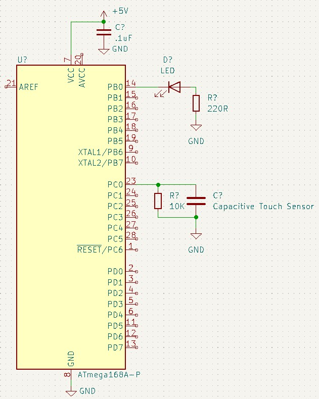
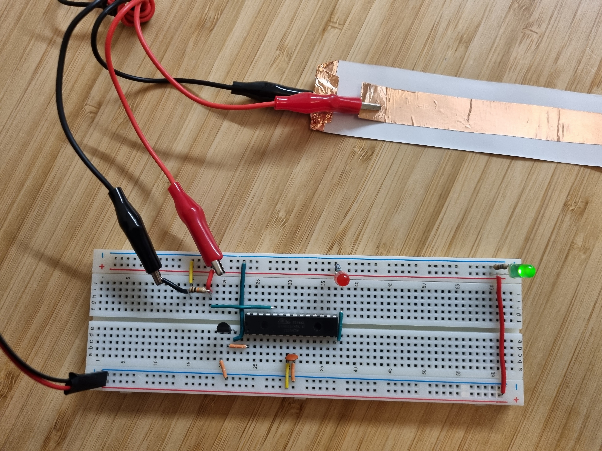

# Capacitive Sensor
## Project Description
This project consists of making a capacitive touch sensor that blinks a light. The project aims to use the pin-change interrupt functionality of the ATmega168.
## Video Demo: <https://youtube.com/shorts/pWDCKngow18>

## Hardware schematic
The hardware consists of an ATmega168, a capacitive touch sensor made with cupper tape, and some electronic components (see schematic).

 
schematic

The image below shows the breadboard wiering.

 
Breadboard layout

## Software description
This program controls a capacitive touch sensor by counting how many times the capacitor is charged and discharged in a period.
The program uses pin-change interrupt to count each charge-discharge cycle and evaluates whether or not the sensor was pressed.
The charge-discharge cycle count gets transmitted through serial to calibrate and debug.

## Acknowledgment:
This project is inspired by example 8.2 of "Make: AVR Programming".