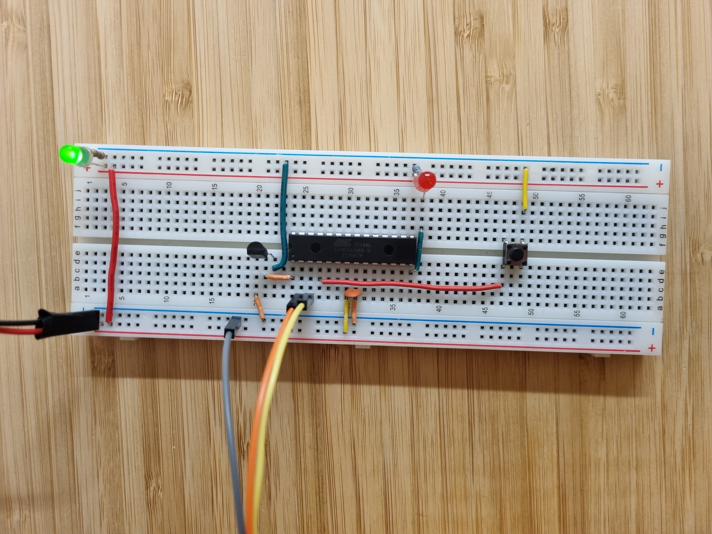

# Reaction Timer
## Project Description
This project measures your reaction time between the moment the LED goes off to the moment you press the button to turn it on and displays the result on the screen via serial.
The program uses a timer/counter that keeps track of how many cycles the timer has overflown.
## Video Demo: <https://youtube.com/shorts/Y_VBzjFf52k>

## Hardware schematic
The hardware consists of an ATmega168, a push button, an LED with current limiting resistor and a TTL serial cable. See schematic below.

 
schematic

The image below shows the breadboard wiering.

 
Breadboard layout

## Software description
The program waits for a keyboard key to be pressed, then it prompts you
to get ready to press the button connected to PD2 when the LED randomly
turns on. The program counts how many times, Timer1 has overflown from 
the moment the LED goes off to the moment the button is pressed.

## Acknowledgment:
This project is inspired by example 9-2 of "Make: AVR Programming".